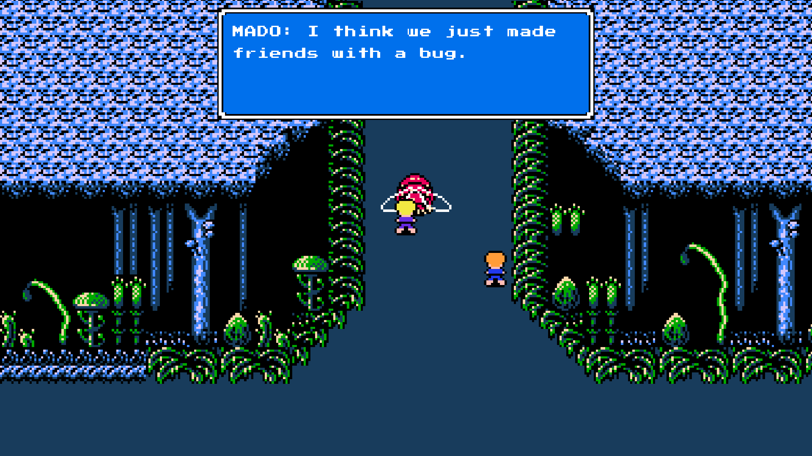
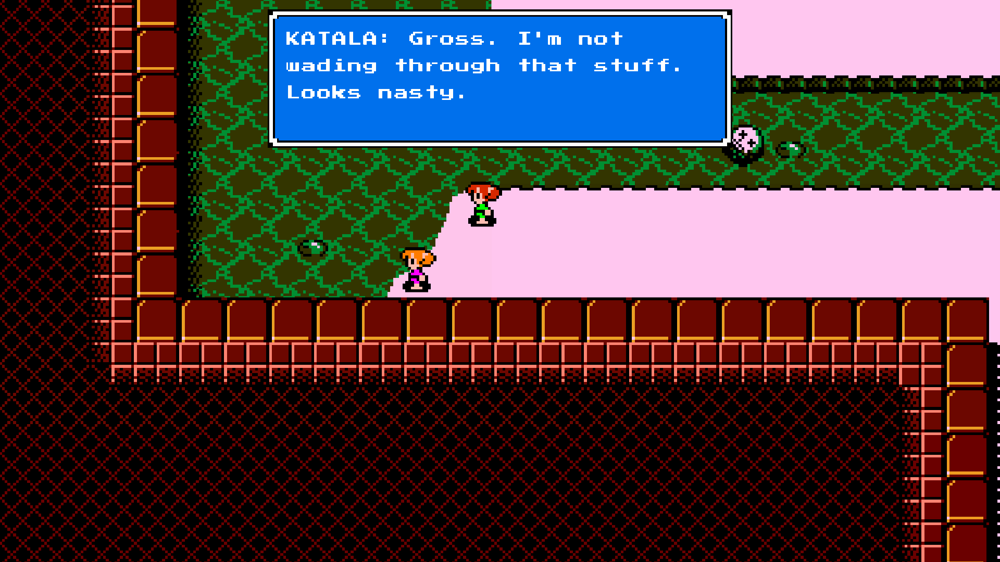
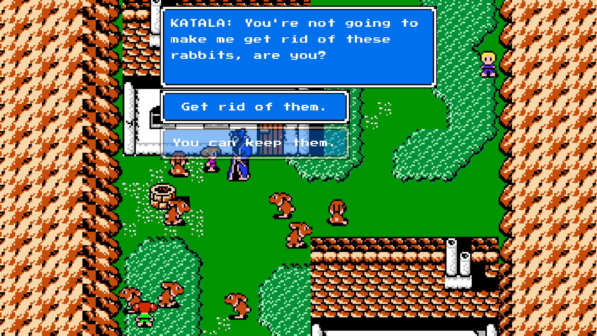
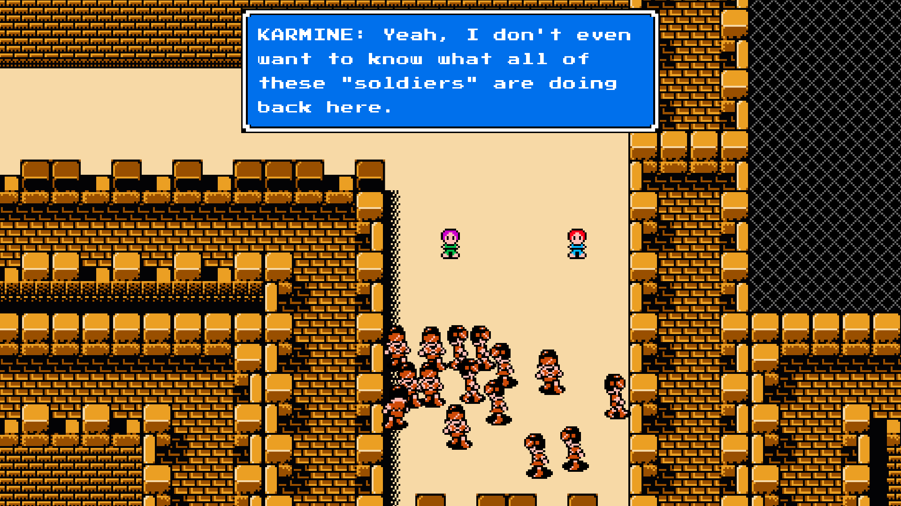

### Info
I made a prequel to (underappreciated) SNK Corporation's 1990 NES game *Crystalis*  because I wanted to learn the Unity Engine (and C# by extension). You can purchase the original Crystalis on Steam as part of the [SNK 40th Anniversary Collection](https://store.steampowered.com/app/865940/SNK_40th_ANNIVERSARY_COLLECTION/).

### Download
A [download](https://mega.nz/folder/VS0mGBLY#FGsCtFkh9rsqWmkxzskFcg) is available for Windows, Linux, and MacOS (although I wasn't able to do any testing for the latter since I don't have any MacOS devices).

### Video and Screenshots

<iframe width="634" height="360" src="https://www.youtube.com/embed/QzLwK2bBIFA" title="Crystalis: Azteca" frameborder="0" allowfullscreen></iframe>

